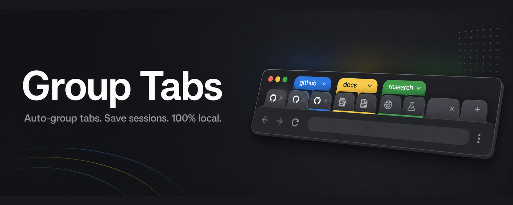
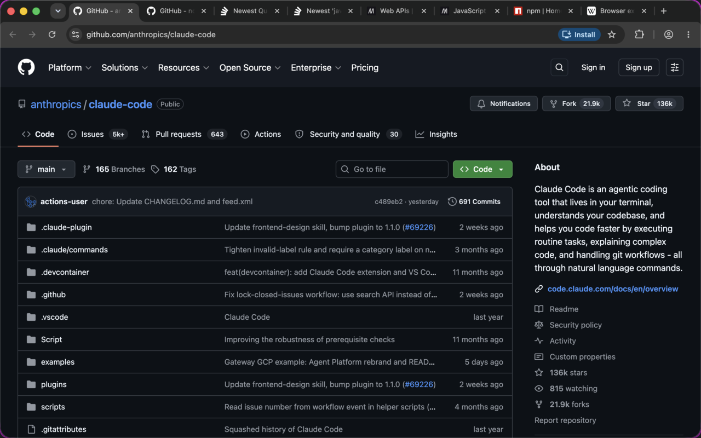
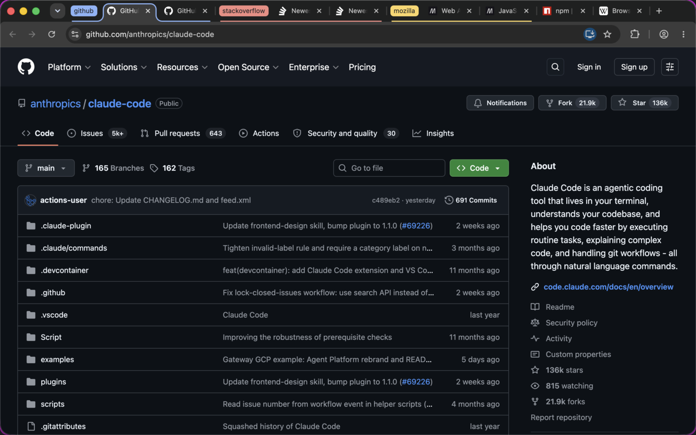

# Group Tabs

Chrome extension: auto-group tabs by domain (Chrome built-in AI classification when Gemini Nano is available), save and restore group snapshots.

**[Website](https://krashnakant.github.io/group-tabs/)** · ⏳ Chrome Web Store — awaiting review

<p align="center">
  
</p>

<p align="center">
  
  
</p>

## Load

1. `chrome://extensions` → enable Developer mode
2. "Load unpacked" → select this folder

## Use

- **Group by domain** — instant. Groups ungrouped, unpinned http(s) tabs in the current window by domain.
- **Refine with AI** — slower. Classifies tabs by topic via the built-in Prompt API (`LanguageModel`, Gemini Nano). Also regroups groups this extension created; manual groups and pinned tabs are never touched. Errors if the on-device model is unavailable.
- **Save** — snapshots all tab groups in the current window (title, color, URLs) to `chrome.storage.local` under the given name.
- **Restore** — reopens a snapshot's tabs and regroups them with original titles/colors.
- **Auto-save** — every group change triggers a debounced (30 s) snapshot to "Auto-saved (crash recovery)". If Chrome crashes and drops your group assignments, restore from there.

## Test

```sh
node test.mjs
```

## Notes

- AI path needs Chrome 138+, ~22 GB free disk, >4 GB VRAM (or 16 GB RAM); silently falls back to domain rules when unavailable.
- Chrome's native "saved groups" have no extension API — snapshots are stored independently in extension storage.
