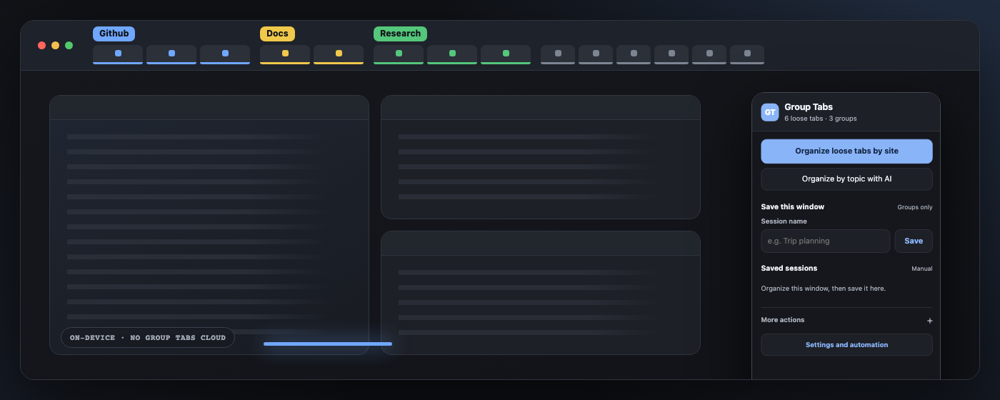
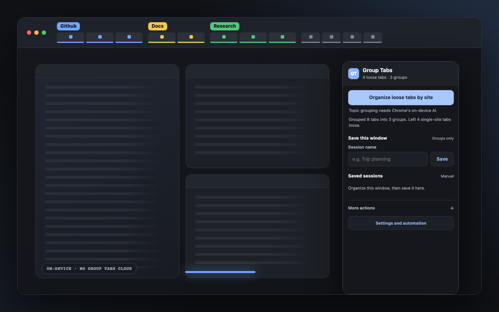
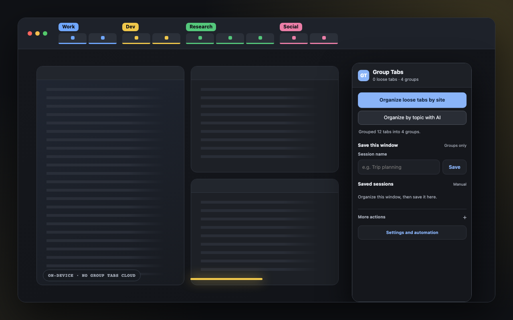

# Group Tabs

Browser extension for Chromium browsers: auto-group tabs by domain (on-device AI classification when the browser's built-in model is available — Gemini Nano in Chrome, Phi-4-mini in Edge), save and restore group snapshots.

**[Website](https://krashnakant.github.io/group-tabs/)** · **[Chrome Web Store](https://chromewebstore.google.com/detail/group-tabs/phgemhmkidohfhckegoemicfjeofnlbp)**

<p align="center">
  
</p>

<p align="center">
  
  
</p>

## Load

1. `chrome://extensions` (or `edge://extensions`) → enable Developer mode
2. "Load unpacked" → select this folder

## Use

- **Organize by site** — instant. Groups matching ungrouped, unpinned http(s) tabs in the current window; single-site tabs stay loose. Same-name tabs join existing groups. Also on `Ctrl+Shift+G` (`Cmd+Shift+G` on Mac).
- **Organize by topic with AI** — slower. Classifies tabs through the built-in Prompt API (`LanguageModel`). Also regroups groups this extension created; manual groups and pinned tabs are never touched. Topic names are customizable in Settings.
- **More actions** — ungroup every group in the current window (with immediate undo), or collapse/expand groups.
- **Save this window** — snapshots all tab groups in the current window (title, color, URLs). Small manual sessions go to `chrome.storage.sync`; large ones stay local.
- **Restore** — opens missing URLs in a new window, skips tabs already open, restores titles/colors, and lazy-loads tabs so large restores do not spike memory.
- **Auto-save** — group changes trigger a throttled local recovery snapshot; the latest three are kept on this device.
- **Auto-group new tabs** — optional: new tabs join or create their site's group as they load.
- **Organize while away** — optional: after 30 minutes without input, sweeps loose tabs by site or topic, falls back to site grouping when AI is unavailable, and records the exact result in Settings.

## Test

```sh
node test.mjs
```

## Notes

- AI works in any Chromium browser exposing the built-in Prompt API: Chrome 138+ (Gemini Nano) and Edge 138+ (Phi-4-mini). Chrome needs ~22 GB free disk and >4 GB VRAM (or 16 GB RAM). Browsers without it (Brave, Opera, Vivaldi) automatically hide the AI options; domain grouping works everywhere.
- The browser's native "saved groups" have no extension API — snapshots are stored independently in extension storage.
